# still. — Meditation & Mental Wellness

[](https://github.com/masudfcs1/still.-Meditation-Mental-Wellness-ReatNative-App/actions/workflows/ci.yml)

**A little more space. A little more you.**

Still is a mobile-first meditation and mental wellness app built with **Expo, React Native, and TypeScript**. It brings timed practices, breathwork, sleep soundscapes, multi-day programs, and personal progress into a calm sage-and-ivory interface that adapts from a phone to a desktop.

Progress comes from **actual practice saved on your device**. New profiles start at zero; the app never fills a user's charts with demonstration activity.

**Project status:** working local-first frontend preview. Responsive web flows are implemented and checked. Native device validation and production services remain future work; this is not an App Store or Google Play release.

## Screenshots

Real screenshots from the responsive web preview, using unseeded local practice data. These show the current interface rather than design mockups; the mobile views are browser previews, not native device captures.

<p align="center">
  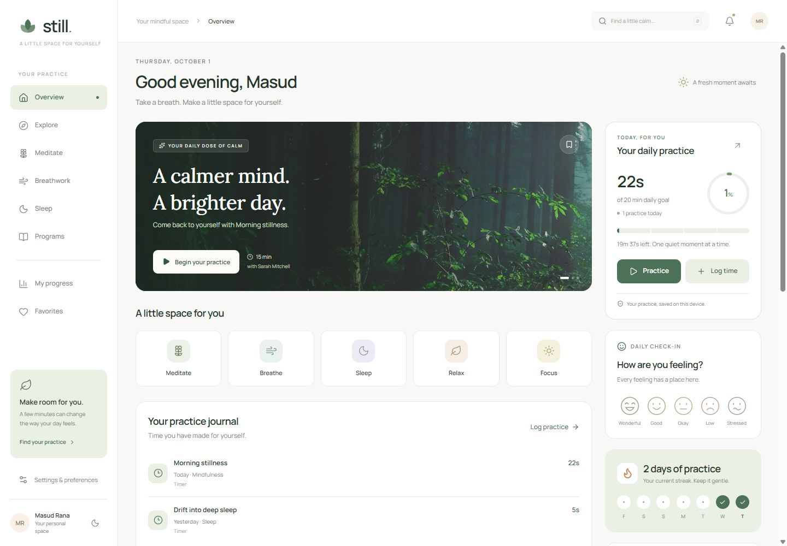
</p>

<table>
  <tr>
    <th>Home</th>
    <th>Progress</th>
    <th>Explore</th>
  </tr>
  <tr>
    <td>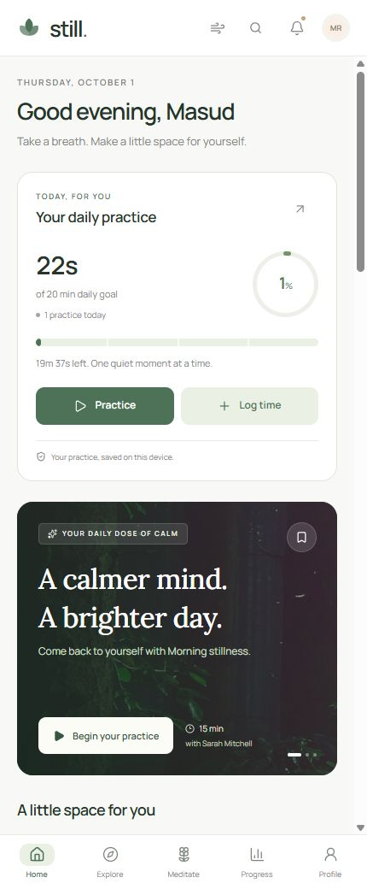</td>
    <td>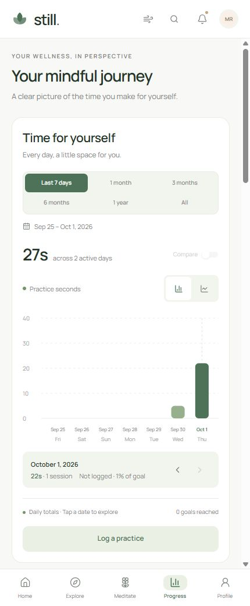</td>
    <td>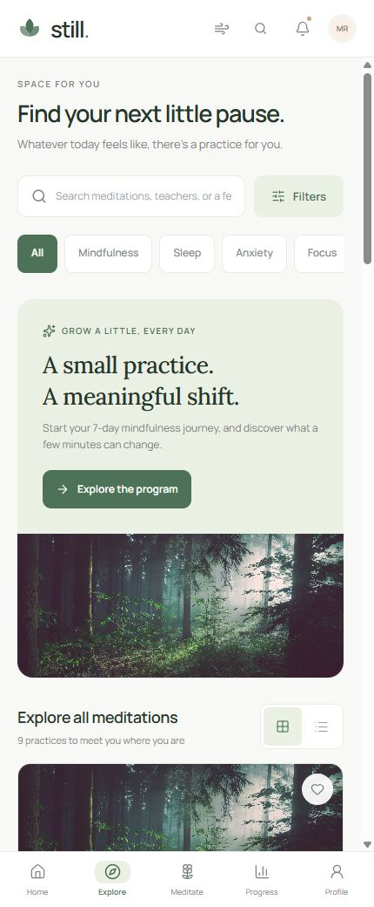</td>
  </tr>
  <tr>
    <th>Breathing</th>
    <th>Programs</th>
    <th>Sleep</th>
  </tr>
  <tr>
    <td>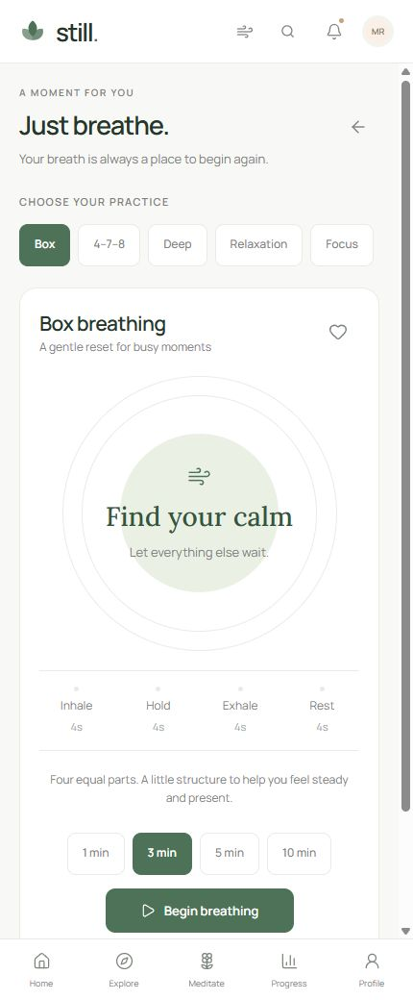</td>
    <td>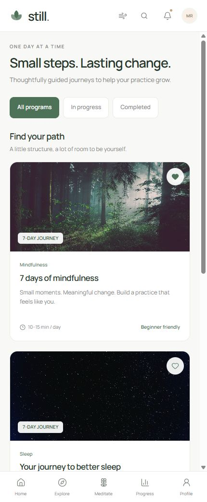</td>
    <td>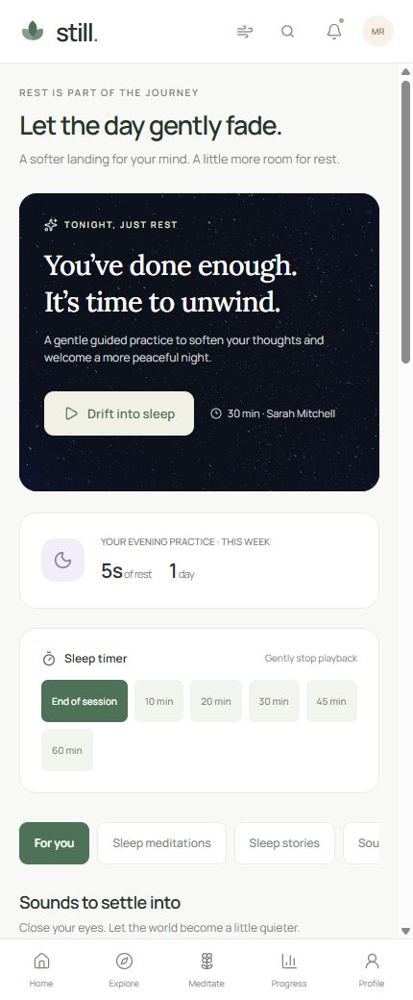</td>
  </tr>
</table>

### Breathing library, routines, and reminder setup

The **Breathe** bottom tab opens a library of **10 categories and 20 visually guided practices**, built from five breathing rhythms. Explore **Calm, Energy, Clear mind, Relaxation, Male power, Box breathing, Lung health, Freedom, Recovery, and Stress relief**. Each category opens its own practice choices; choosing one prepares its actual rhythm and suggested duration. The timer supports one, three, five, or ten minutes.

<table>
  <tr>
    <th>Breathe categories</th>
    <th>Desktop breathing library</th>
  </tr>
  <tr>
    <td><a href="docs/screenshots/breathing-categories.png">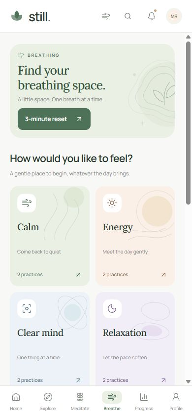</a></td>
    <td><a href="docs/screenshots/breathing-library-desktop.png">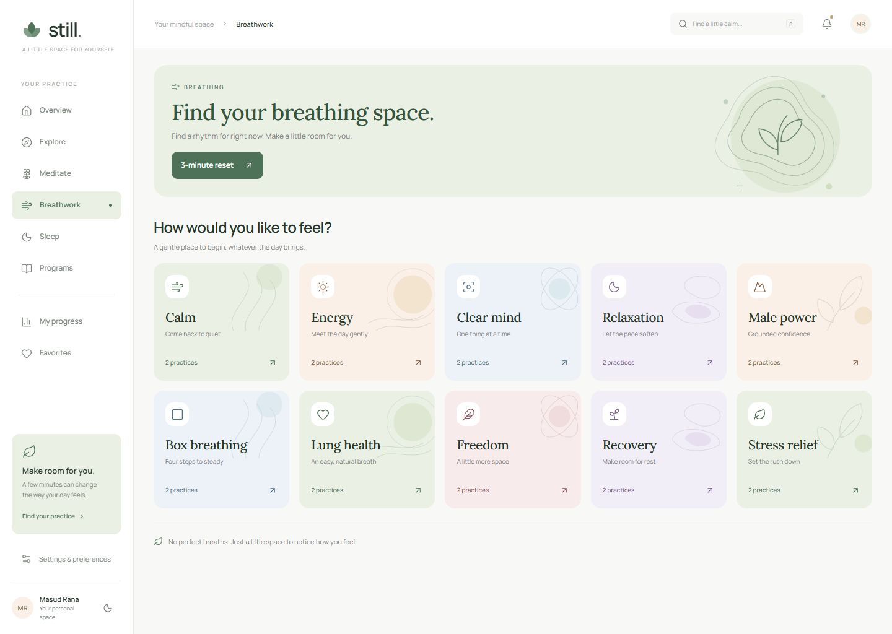</a></td>
  </tr>
</table>

The practice screen also includes illustrated Morning reset, Between tasks, and Evening unwind routines. Choosing one prepares its pattern and duration, then brings the timer into view. An unfinished practice stays protected until it is finished or reset. Existing direct exercise links continue to work; invalid or ambiguous catalog links fall back to the category or library safely.

<p align="center">
  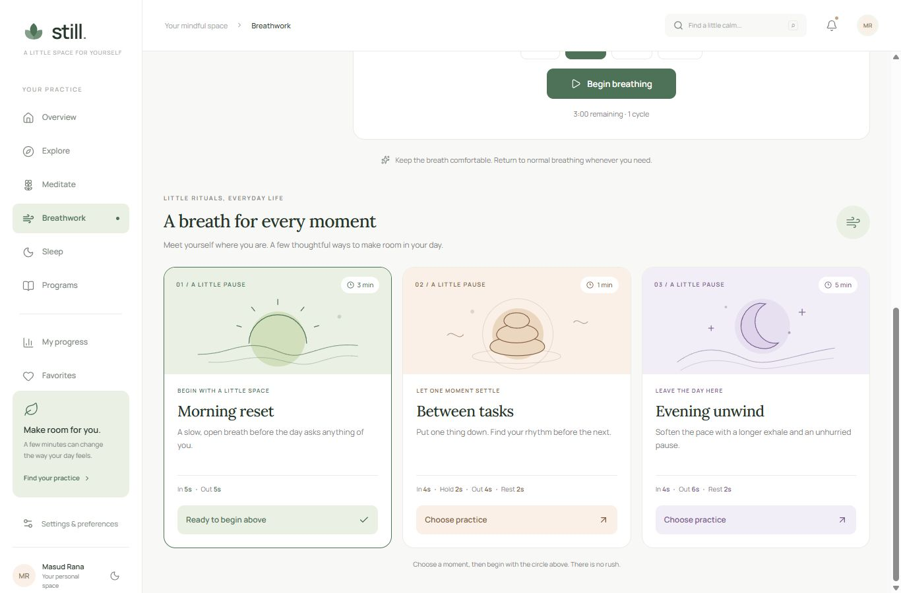
</p>
<p align="center">
  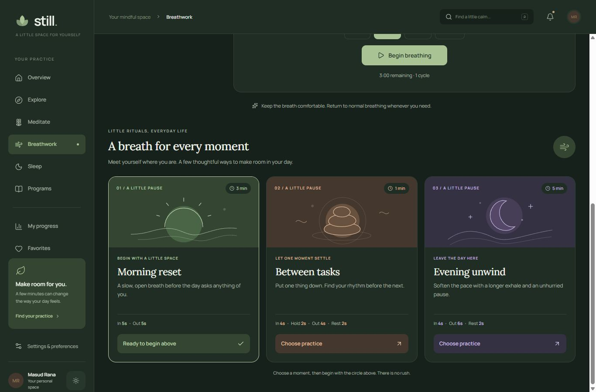
</p>
<p align="center">
  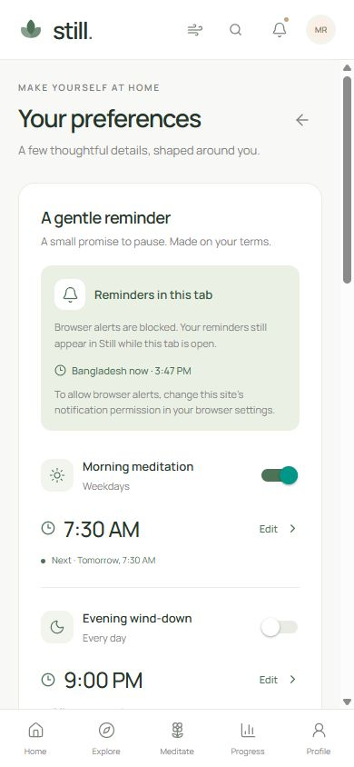
</p>

## Features

| Experience | What's included |
| --- | --- |
| **Home** | Daily intention and animated goal progress, precise practice time, mood check-in, streak, weekly overview, recommendations, and a compact program journey card. |
| **Explore & Meditate** | Search across titles, teachers, categories, and feelings; duration, experience, and teacher filters; category chips; grid and list layouts; meaningful empty states. |
| **Meditation player** | Real ambient audio playback, play/pause, 15-second seek controls, volume, background sound selection, sleep timer, favorites, and a mini-player while browsing. |
| **Breathing** | The **Breathe** tab opens 10 categories and 20 guided practice options using five visual rhythms: Box, 4–7–8, Deep, Relaxation, and Focus. Category and practice links select the actual rhythm and duration. Choose 1, 3, 5, or 10 minutes, follow animated phases, pause/resume, save favorites, and record completed practice. Three illustrated daily routines remain available. Leaving the screen or backgrounding the app pauses the exercise. |
| **Sleep** | Evening session and story catalog, four soundscape entry points, ambient playback, and sleep timer preferences. Story and teacher titles are demonstration catalog content; spoken narration is not included. |
| **Programs** | Three structured journeys: 7 days of mindfulness, 7 days of better sleep, and 5 days of focus. Lesson details, sequential unlocking, favorites, and locally saved progress. |
| **Progress** | “Time for yourself” opens first with a **7-day bar chart**. Switch between bar and line views; filter Last 7 days, 1 month, 3 months, 6 months, 1 year, or All; inspect dates and compare with the previous period when data is available. |
| **Wellness insights** | Mindful time, session counts, daily averages, current and longest streaks, activity calendar, consistency heatmap, goal completion, category distribution, mood trends, and breathing/sleep totals. |
| **Practice journal** | Log practice completed outside the app with date, duration, category, and an optional title. Review saved records and remove manual entries after confirmation. All totals update immediately. |
| **Favorites** | Save and revisit meditations, programs, breathing exercises, sleep sessions, and soundscapes in a filterable personal collection. |
| **Profile & achievements** | Edit a local profile, choose a daily goal, review personal statistics, and track ten milestones earned from real activity. |
| **Settings** | Light, dark, and system appearance; sound preferences; scheduled reminders with repeat days and permission controls; help and privacy information; private feedback drafts. |
| **Responsive design** | Bottom navigation on phones with a dedicated **Breathe** tab, a sidebar on wider screens, shared design tokens, accessible control labels, and reduced-motion support where applicable. |

## Implementation status

| Area | Status | Current boundary |
| --- | --- | --- |
| Responsive app screens and navigation | **Implemented** | Expo Router routes, mobile layouts, desktop sidebar, and light/dark themes. |
| Practice tracking and local persistence | **Implemented** | Actual active time, dated mood check-ins, manual logs, goals, favorites, and program progress are stored locally. |
| Charts and wellness insights | **Implemented** | Calculated from the same local history used by Home, Profile, Sleep, and achievements. |
| Breathing library and practice | **Implemented** | Ten categories, 20 practice choices, five shared visual rhythms, validated route and duration selection, and completed practice tracking. Guidance is visual; spoken coaching is not included. |
| Audio player | **Implemented** | Bundled synthesized ambient loops through `expo-audio`; no prerecorded instruction, spoken stories, or instructor narration. |
| Content library | **Demonstration catalog** | Session titles, teacher names, program descriptions, and artwork form a preview library. |
| Reminders | **Implemented; native device verification pending** | Bangladesh-time schedules, repeat days, permission handling, edit/off cancellation, and a five-second test. iOS/Android use local device notifications; the browser requires an open tab. |
| Feedback | **Local draft only** | Saved on the current device; never submitted to a server or sent to another person. |
| Authentication and cloud sync | **Not implemented** | No account system, backend, cloud database, or cross-device history. |
| Payments and subscriptions | **Not implemented** | No checkout or subscription service. |
| Native release | **Not validated** | iOS/Android device testing, native release builds, signing, and store submission are not claimed as complete. |

## Run locally

Use **Node.js 22.13 or newer** and npm. No API keys or backend configuration are required for the current preview.

```sh
git clone https://github.com/masudfcs1/still.-Meditation-Mental-Wellness-ReatNative-App.git
cd still.-Meditation-Mental-Wellness-ReatNative-App
npm ci
npm run web
```

Open the local URL printed by Expo, normally `http://localhost:8081`.

For the Expo development server and device connection instructions:

```sh
npm start
```

Use a compatible Expo Go client or a development build for the installed Expo SDK. `npm run android` and `npm run ios` open an available emulator or simulator; iOS simulators require macOS. Native directories are generated by Expo when needed. Keep native configuration in `app.json` and config plugins.

### Commands

| Command | Purpose |
| --- | --- |
| `npm start` | Start the Expo development server. |
| `npm run web` | Start the browser preview. |
| `npm run android` | Start Expo and open an available Android environment. |
| `npm run ios` | Start Expo and open an available iOS simulator on macOS. |
| `npm run lint` | Run Expo ESLint checks. |
| `npm run typecheck` | Check TypeScript without emitting files. |
| `npm test` | Run analytics, practice-ledger, reminder, and breathing catalog, route, duration, and routine tests. |
| `npm run build:web` | Export the web app to `dist/`. |

## How progress is recorded

The daily goal meter, charts, streaks, achievements, and profile statistics all read the same practice ledger. The supported daily goals are **5, 10, 15, 20, 30, 45, or 60 minutes**.

- **Actual time:** active playback is saved as the timer advances, with seconds retained precisely. Pausing and seeking add no practice time.
- **Safe transitions:** finishing, closing the player, changing sessions, or refreshing preserves time already recorded without counting it twice.
- **Local dates:** sessions crossing midnight allocate time to the appropriate local dates. Mood check-ins retain earlier days when today's mood changes.
- **Lesson completion:** a program lesson unlocks the next step only after its full duration has actually been practiced.
- **Breathwork:** a completed breathing exercise records its active intervals once, excluding paused time.
- **Manual practice:** “Log time” records activity performed outside the app, including past dates. Removing a manual entry recalculates affected totals and streaks.
- **Honest empty states:** a new profile has no recorded activity or earned lessons. Sample history is used by tests and is never added to a user's totals.

Zustand manages state, and AsyncStorage persists the local profile, goals, favorites, practice records, mood history, program progress, appearance, sound preferences, reminders, and feedback drafts. On the web, that data belongs to the current browser profile. Clearing app storage removes it; there is no account sync or cloud backup. Storage errors are surfaced in the app.

Existing real practice from the initial prototype is preserved during migration. Demonstration lesson progress is removed unless backed by a recorded lesson.

## Set up reminders

Open the header bell → **Manage reminders**, or Profile → Settings. Choose a reminder, set its time, select repeat days, and turn it on. All reminder times use **Bangladesh time (Asia/Dhaka, UTC+6)**. Practice history retains its existing device-local dates.

- **iOS and Android:** grant notification permission when prompted. The operating system delivers scheduled local notifications while Still is closed. Tapping one opens meditation, sleep, or breathwork. Edits replace old schedules; turning a reminder off cancels it.
- **Browser:** in-app reminders work while a tab stays open. Browser notifications are optional and require permission. Closed or suspended browsers cannot reliably deliver timed alerts; no remote push service is configured. Open tabs coordinate to avoid duplicate alerts and respect saved schedule changes.
- **Try it:** tap **Send a test reminder** for an alert after about five seconds. Tests never add practice time or enable a repeating schedule.
- **Saved preferences:** schedules are restored after loading and refreshed when the app returns to the foreground. Earlier preview-only reminders retain their times and days but require an explicit opt-in to start delivery. Permission and storage failures are shown without falsely saving a successful setup.

Native configuration lives in `app.json`, including the notification channel, Android notification icon, and `SCHEDULE_EXACT_ALARM` permission. Build a new iOS/Android development or release binary after installing this native module; a web export cannot apply native notification configuration. Device notification permission, Focus modes, battery restrictions, and Android Alarms & reminders access can affect sound or timing. Android uses an inexact fallback when exact-alarm access is unavailable.

On iOS, repeating calendar notifications explicitly use Asia/Dhaka. Android's weekly notification API uses device-local time, so Still converts the Bangladesh schedule and refreshes it on app open. **Reopen Still after changing the Android device timezone or crossing a daylight-saving transition** to update that conversion. Native delivery still needs verification on physical iOS and Android devices.

## Tech stack

| Layer | Technology |
| --- | --- |
| App framework | Expo SDK 57, React Native 0.86.3, React 19.2.3 |
| Language | TypeScript 6 |
| Navigation | Expo Router |
| State and persistence | Zustand 5, AsyncStorage |
| Reminders | `expo-notifications` for iOS/Android; optional browser notifications and in-app alerts on web |
| Audio | `expo-audio` with bundled ambient WAV loops |
| Animation and graphics | Reanimated 4, React Native SVG, Gifted Charts |
| Design | Manrope and Lora typography, Lucide icons, shared theme tokens |
| Web | React Native Web, Metro, single-page export |
| Verification | ESLint, TypeScript, Node.js test runner |

## Project structure

```text
src/
  app/                   Expo Router routes and root layout
  components/            Shared typography, controls, cards, and feedback
  features/
    analytics/           Charts, calendar, dashboard, and calculation tests
    breathing/           Category catalog, routines, animated timer, and route tests
    explore/             Content discovery and filters
    favorites/           Saved practices and programs
    home/                Daily dashboard and journey card
    meditation/          Audio engine, player, and sound controls
    practice/            Manual logging and saved activity journal
    profile/             Profile, settings, and achievements
    programs/            Structured meditation programs
    reminders/           Bangladesh-time scheduling, permissions, UI, and tests
    sleep/               Sleep library and sound data
  hooks/                 Local activity and date rollover
  mock/                  Content catalog and activity fixtures for tests
  navigation/            Responsive app shell and route mapping
  store/                 Zustand state, persistence, ledger, and playback tests
  theme/                 Shared colors and typography
  types/                 Domain and navigation types
  utils/                 Date handling, accessibility, and analytics calculations
assets/
  audio/                 Bundled synthesized ambient loops
  images/                Bundled session artwork
docs/screenshots/        Captured mobile and desktop web previews
scripts/                 Audio and brand asset generation helpers
```

Routes stay in `src/app/`; components and business logic stay outside it. Analytics calculations are separated from chart rendering in [`src/utils/analytics.ts`](src/utils/analytics.ts). [`src/store/useAppStore.ts`](src/store/useAppStore.ts) owns persisted preferences and activity alongside transient playback state, with ledger helpers in [`src/store/practiceLedger.ts`](src/store/practiceLedger.ts).

## Verification and deployment

```sh
npm run lint
npm run typecheck
npm test
npm run build:web
```

The current automated suite contains **111 tests** covering date ranges and labels, calendar and leap-year boundaries, aggregation, comparisons, streaks, mood history, persistence and migration, exact playback credit, seeking, timers, midnight transitions, breathing intervals, manual records, program completion, storage failures, notification permissions, schedule rollback, cancellation, Bangladesh time, and browser cross-tab delivery. Breathing coverage also checks every category and practice, preserved rhythm timings, supported durations and routine links, and safe handling of invalid or ambiguous routes.

The responsive web interface has also been reviewed in a browser. Browser review, lint, type checking, and automated tests do not replace native device testing. JavaScript exports for web, Android, and iOS have been verified.

`npm run build:web` creates a deployable export in `dist/`. The app uses single-page web output: configure the production host to serve `index.html` for app routes so direct links such as `/analytics`, `/breathing?category=calm&practice=soft-landing`, and existing `/breathing?exercise=box` links work.

### GitHub Actions

The [App CI workflow](.github/workflows/ci.yml) is configured for **pushes to `main`, pull requests, and manual runs**. It installs locked dependencies with Node.js 24, then runs lint, type checking, and all 111 tests. After those checks pass, separate jobs export the **web, Android, and iOS JavaScript bundles**.

From a completed [workflow run](https://github.com/masudfcs1/still.-Meditation-Mental-Wellness-ReatNative-App/actions/workflows/ci.yml), download the `still-web-<commit>` artifact to inspect or host the web export. Artifacts are retained for **7 days**. These checks validate JavaScript exports; they do not build or sign an APK, Android App Bundle, or IPA, submit to an app store, or replace native device testing.

Before a production release, complete native iOS/Android validation and release builds, replace demonstration catalog content with the intended audio library, and implement any required account, sync, remote push, or payment services. Local reminder delivery is implemented without a backend.

## Development notes

This project uses **Expo SDK 57**. Read the [matching Expo documentation](https://docs.expo.dev/versions/v57.0.0/) before changing Expo or React Native integrations. Install SDK-compatible dependencies with `npx expo install <package>` and keep native configuration in `app.json` and config plugins. Navigation follows [Expo Router](https://docs.expo.dev/router/introduction/).

## Artwork and license

See [ASSETS.md](ASSETS.md) for photography, original ambient audio, icons, and font attribution, and [LICENSE](LICENSE) for the included MIT license.
